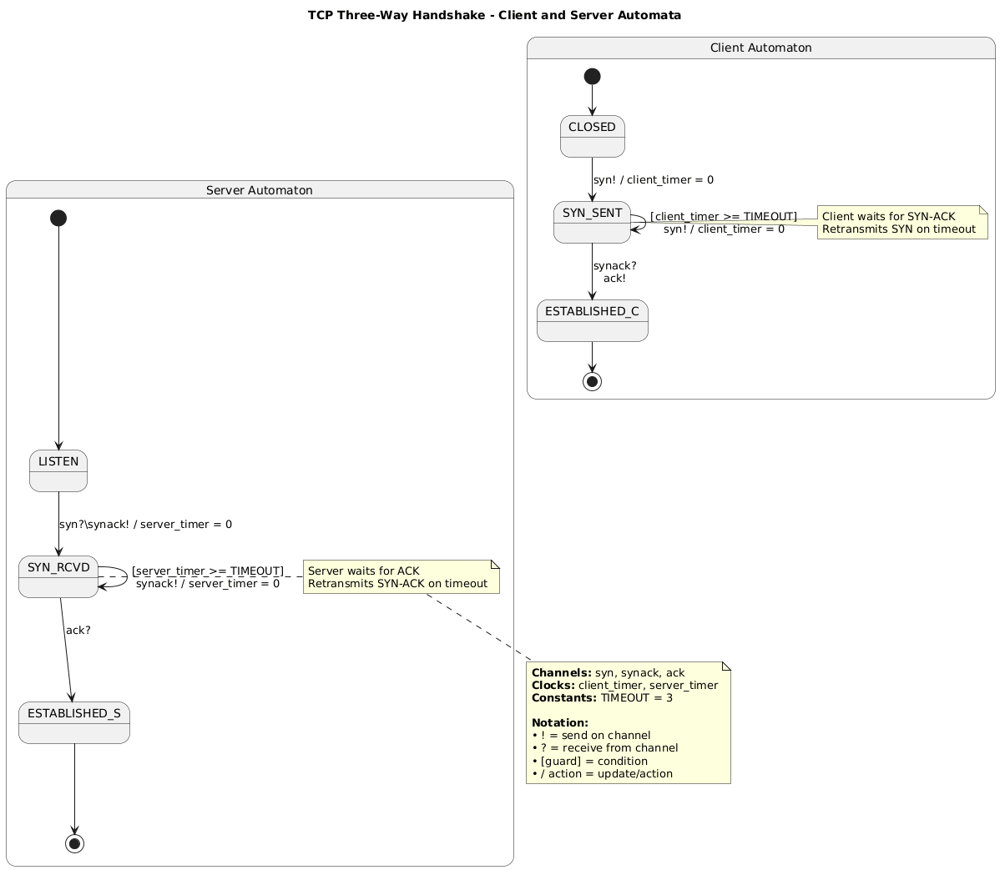

# TCP

## Table content

1. what is ``TCP``
2. ``TCP`` packet 
3. Acknowledgment and Sequence Number
4. 3 Way handshake and sending data
5. Automata Flow for ``TCP``

## 1. What is TCP

To understand ``TCP`` we need to see what is the problem that it's solve 

When two devices communicate over a network—like your computer loading a webpage from a
server—the data must travel reliably across potentially unreliable links. Networks can lose
packets, deliver them out of order, or even duplicate them. Without a way to handle these issues,
applications would receive incomplete, jumbled, or missing data, making things like web browsing,
email, or file transfers unreliable or impossible.

Transmission Control Protocol ``(TCP)`` was designed to solve this problem. It provides a
reliable, ordered, and error-checked delivery of data between applications running on hosts
communicating over an IP network.

``TCP`` ensures reliability by:

    - Acknowledging received data (so the sender knows it arrived),
    - Retransmitting lost packets,
    - Putting data back in the correct order if packets arrive out of sequence,
    - Controlling the flow of data to avoid overwhelming the receiver,
    - Checking for errors using checksums.

In short, ``TCP`` turns an unreliable network into a dependable communication channel for
applications that can’t afford to lose or disorder data.

## 2. TCP packet 

```bash

  0                   1                   2                   3
  0 1 2 3 4 5 6 7 8 9 0 1 2 3 4 5 6 7 8 9 0 1 2 3 4 5 6 7 8 9 0 1
 +-+-+-+-+-+-+-+-+-+-+-+-+-+-+-+-+-+-+-+-+-+-+-+-+-+-+-+-+-+-+-+-+
 |          Source Port          |       Destination Port        |
 +-+-+-+-+-+-+-+-+-+-+-+-+-+-+-+-+-+-+-+-+-+-+-+-+-+-+-+-+-+-+-+-+
 |                        Sequence Number                        |
 +-+-+-+-+-+-+-+-+-+-+-+-+-+-+-+-+-+-+-+-+-+-+-+-+-+-+-+-+-+-+-+-+
 |                    Acknowledgment Number                      |
 +-+-+-+-+-+-+-+-+-+-+-+-+-+-+-+-+-+-+-+-+-+-+-+-+-+-+-+-+-+-+-+-+
 | Data |           |U|A|P|R|S|F|                               |
 |Offset| Reserved  |R|C|S|S|Y|I|            Window              |
 |      |           |G|K|H|T|N|N|                               |
 +-+-+-+-+-+-+-+-+-+-+-+-+-+-+-+-+-+-+-+-+-+-+-+-+-+-+-+-+-+-+-+-+
 |           Checksum            |         Urgent Pointer        |
 +-+-+-+-+-+-+-+-+-+-+-+-+-+-+-+-+-+-+-+-+-+-+-+-+-+-+-+-+-+-+-+-+
 |                    Options (if any)                           |
 +-+-+-+-+-+-+-+-+-+-+-+-+-+-+-+-+-+-+-+-+-+-+-+-+-+-+-+-+-+-+-+-+
 |                    Data (Payload)                             |
 +-+-+-+-+-+-+-+-+-+-+-+-+-+-+-+-+-+-+-+-+-+-+-+-+-+-+-+-+-+-+-+-+
```

| Field              | Size (bits) | Description |
| :---------------- | :------: | ----: |
| Source Port        |   16   | Port number of the sender |
| Destination Port           |   16   | Port number of the receiver |
|   Sequence Number |  32   | Order of bytes sent |
| Acknowledgment Number |  32   | Next byte expected by receiver |
| Data Offset |  4   | Header length (in 32-bit words) |
| Reserved |  6   | Reserved for future use (set to 0) |
| Flags|  6   | Control bits: URG, ACK, PSH, RST, SYN, FIN |
| Window|  16   | Number of bytes the sender is willing to receive |
| Checksum |  16   | Error-checking for header and data |
| Urgent Pointer |  16   | If URG flag is set, points to urgent data |
| Options|  Variable   | Used for things like MSS, timestamps |
| Data |  Variable   | Actual transmitted data |


```bash
+---------------------+----------------------+----------------------+----------------------+----------------------+
|       FRAME         |       IP HEADER      |       TCP HEADER     |        DATA          |       TRAILER        |
+---------------------+----------------------+----------------------+----------------------+----------------------+
```
this show how the data is warped
## 3. Acknowledgment and Sequence Number

### Acknowledgment Number (ACK)
The ``acknowledgment number`` is used by the ``receiver`` to tell the ``sender`` which bytes have been
successfully received. It indicates the next expected sequence number—meaning 
>“I’ve received everything up to this point; send me data starting here.”

ACK numbers are only valid when the ACK flag in the TCP header is set (which is almost always
after the connection is established).
***Example:***
If a receiver gets bytes 5000–5999, it sends back an ACK with number 6000, meaning “I’m ready for
byte 6000 onward.”

### Sequence Number

Every byte of data transmitted in a ``TCP`` connection is assigned a sequence number.
The sequence number in a ``TCP`` segment indicates the position of the first byte of that segment in
the overall data stream. This allows the ``receiver`` to reassemble segments in the correct order,
even if they arrive out of sequence. The initial ``sequence number`` (ISN) is randomly chosen at the
start of a connection ``(during the 3-way handshake)`` for security and uniqueness.

***Example:***
If a sender transmits 1000 bytes starting at sequence number 5000, those bytes are numbered 5000
to 5999. The next segment will start with sequence number 6000.

## 4. 3 Way handshake and sending data

The 3-way handshake is the process TCP uses to establish a reliable connection between two devices (usually called the client and the server) before any data is exchanged.

It involves three steps, each exchanging special TCP segments with specific control flags:

### Step 1: SYN (Synchronize)
- The client wants to start a connection, so it sends a TCP segment with:
    - The SYN flag = 1
    - An initial sequence number (ISN) chosen randomly (e.g., Seq = 1000)
- This says: “Hi, I’d like to connect. My starting sequence number is 1000.”
### Step 2: SYN-ACK (Synchronize-Acknowledge)
- The server responds with a segment that has:
    - SYN = 1 (to synchronize its own sequence number)
    - ACK = 1 (to acknowledge the client’s SYN)
    - Its own initial sequence number (e.g., Seq = 3000)
    - An acknowledgment number = client’s ISN + 1 (e.g., Ack = 1001)
- This means: “I agree to connect. My starting number is 3000, and I expect your next byte to be 1001.”
### Step 3: ACK (Acknowledge)
- The client sends a final segment with:
    - ACK = 1
    -Acknowledgment number = server’s ISN + 1 (e.g., Ack = 3001)
    -(Sequence number is now 1001, continuing from its first segment)
- This confirms: “Got it! I’m ready to send/receive data starting from your byte 3001.”
After these three steps, the connection is fully established.
Both sides now know:
- Each other’s initial sequence numbers, That the other is ready to communicate, And how to
correctly number and acknowledge future data.
Only after the 3-way handshake does actual data transfer begin.
### Sequence Diagram

```bash
Client (192.168.3.8:1600)             Server (192.168.3.5:5600)
       |                                      |
       |--- SYN (seq=1000) ------------------>|
       |<-- SYN-ACK (seq=3000, ack=1001) -----|
       |--- ACK (seq=1001, ack=3001) -------->|
       |                                      |
       |--- DATA (seq=1001, len=100) -------->|
       |<-- ACK (seq=3001, ack=1101) ---------|
       |                                      |
       |<-- DATA (seq=3001, len=50) ----------|
       |--- ACK (seq=1101, ack=3051) -------->|
       |                                      |
       |--- FIN-ACK (seq=1101, ack=3051) ---->|
       |<-- ACK (seq=3051, ack=1102) ---------|
       |<-- FIN-ACK (seq=3051, ack=1102) -----|
       |--- ACK (seq=1102, ack=3052) -------->|
       |                                      |
       [Connection Closed]
```
## 5. Automata Flow for TCP



